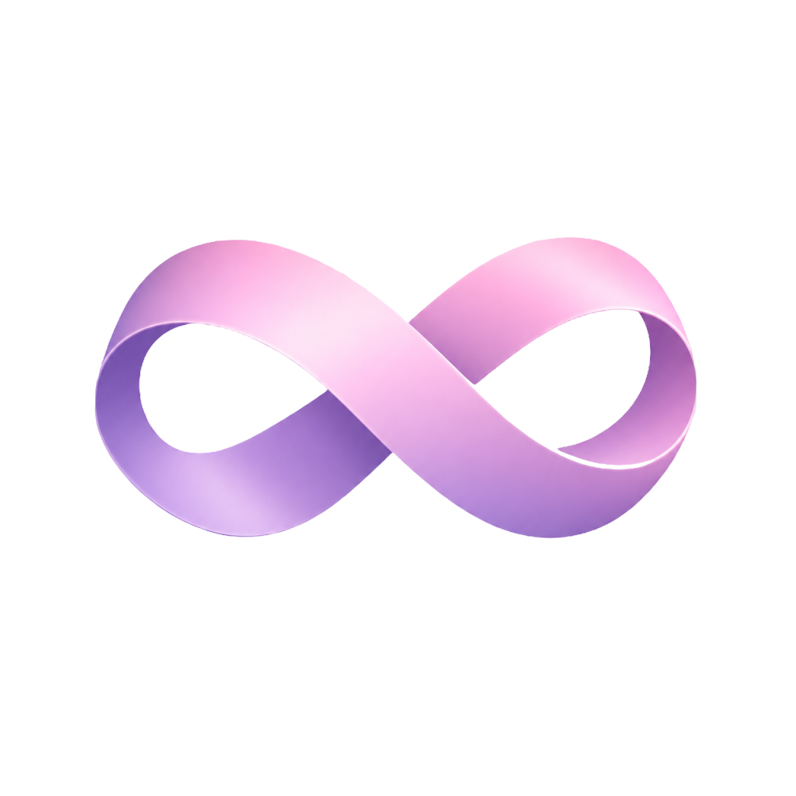

<div align="center">



# Mobius

### 会自我进化的智能体开发环境

**Mobius 越用越聪明。** 它会观察你的工作方式，把成功的操作沉淀成可复用的 **Skill（技能）**，再通过基于意图识别的推荐算法，自动为每个任务匹配最合适的 Skill——Agent 的能力会随着使用不断累积，而不是每次对话都从零开始。

[](LICENSE.txt)
[-blue)]()
[]()
[-purple)]()

[English](README.md) · [简体中文](README.zh-CN.md)

</div>

---

## 为什么是 Mobius

绝大多数 AI IDE 是无状态的：每次对话都是一个全新的 prompt，关掉标签页，"Agent"就把一切都忘了。

Mobius 不一样。它是一个 **ADE — Agentic Development Environment（智能体开发环境）**，围绕一个核心理念构建：

> AI 编程伙伴应当积累技能，而不只是消耗 token。

Mobius 在 [VS Code](https://github.com/microsoft/vscode) 分支的基础上，内置了 [Continue](https://github.com/continuedev/continue) 智能体引擎，并在其上增加了三层能力：

| 层级 | 作用 |
|---|---|
| 🧠 **自我总结 Skill** | 把 Agent 成功完成的任务，蒸馏成可复用、可版本化的 Skill（Markdown 操作手册 + 工具集）。完成的任务越多，Skill 库越丰富。 |
| 🎯 **意图 → Skill 推荐** | 混合 embedding + 词法检索，读懂用户请求的意图，自动把最相关的 Skill 预加载到 Agent 上下文中——无需手动输入 `/skill`。 |
| 🔄 **RSI（即将上线）** | *Recursive Self-Improvement，递归自我改进*。在**受控沙箱**内（隐藏的验收测试集、独立评估器、质量门禁、人工审批），让 Agent 提出对自身 Skill 的修改建议，自动验证，只有胜出的候选版本才会晋升。参考实现见 [`rsi-test/`](rsi-test/README.md)。 |

最终效果：一个使用越久、Agent 能力越强的 IDE——你的每一次成功，都会变成它的本能。

---

## 特性一览

- **基于 VS Code OSS 分支**——完整的编辑器体验、扩展、快捷键、主题。
- **内置 Continue**——对话、内联编辑、`@codebase` 代码库索引、自动补全。
- **本地 embedding + OCR**——`@codebase` 使用进程内 `transformers.js`（`all-MiniLM-L6-v2`）；GLM-OCR 仍走内置 Ollama。对话走云端模型。
- **Skill 系统**——基于文件的 Skill，位于 `.agents/skills/`，支持热加载、通过 git 分享。
- **意图驱动的 Skill 匹配**——混合召回（embedding + 词法）针对每次提问给 Skill 打分并预加载 Top 匹配。
- **可插拔 agent harness（路线图）**——目前 Continue 是内置且唯一的 harness；路线图上会抽出一层 harness 抽象，让多个 agent 引擎（如 DeepSeek 的 agent harness）可以插拔共存、与 Continue 相辅相成，而不是替换。
- **多 Agent 工具超集**——默认同时提供 Continue 与 GitHub Copilot Chat 工具（`MOBIUS_SKIP_COPILOT=1` 可切换）。
- **路线图：RSI 闭环**——沙箱化自我改进，训练/验收数据隔离、5 项质量门禁、人工审批。

---

## 架构

```
Mobius/
├── vscode/                # Mobius 工作台（VS Code 分支，子模块）
├── continue/              # Continue 智能体引擎 → 链接到 vscode/extensions/continue
├── hermes-agent/          # 参考用的 agent loop / skills / memory（只读子模块）
├── rsi-test/              # RSI（递归自我改进）参考闭环
├── .agents/skills/        # ← Mobius Skill 存放位置（自动发现）
├── resources/ollama/      # 内置 Ollama 运行时（amd64 + arm64）+ 模型
├── scripts/               # 构建、启动、打包自动化脚本（PowerShell）
├── config/                # Continue + Mobius 配置模板
└── .env                   # AI 提供商密钥（同步到 ~/.continue/config.yaml）
```

与 VS Code / Continue 上游的 rebase 流程见 [REBASE.md](REBASE.md)。`hermes-agent` 是来自 [NousResearch/hermes-agent](https://github.com/NousResearch/hermes-agent) 的只读参考子模块，用于对照其 agent loop、skills、memory 设计。

---

## 快速开始

> 🪟 **目前仅支持 Windows。** Mobius 现在只能在 Windows 10/11（x64 与 ARM64）上构建和运行。构建脚本全部是 PowerShell，打包使用 Inno Setup，内置 Ollama 也是 Windows 版本。Linux/macOS 支持已在路线图上——底层 VS Code OSS 本身已跨平台；欢迎参照[参与贡献](#参与贡献)一节帮助移植脚本。

```powershell
# 1. 克隆（含子模块）
git clone --recurse-submodules https://github.com/<your-org>/mobius.git
cd mobius

# 2. 配置 AI 提供商
copy .env.example .env
notepad .env   # 填入 OPENAI_API_KEY（或任意 OpenAI 兼容端点）

# 3. 检查工具链
npm run check

# 4. 首次构建（约 20–40 分钟：Continue + Mobius 工作台）
npm run install:continue
npm run build:vscode

# 5. 启动
npm start
```

`npm start` 会启动已预载 Continue 的 Mobius。打开 Continue 侧边栏即可对话、编辑、索引代码库。

---

## 编译环境要求

Mobius 会编译原生 Node 模块（sqlite3、`@parcel/watcher`、LanceDB 等），并打包 Electron 应用。`npm run check` 会逐项校验以下工具链。

### 必需软件

| 组件 | 版本 | 说明 |
|---|---|---|
| **Windows** | 10 / 11 x64 或 ARM64 | **目前唯一支持的构建与运行平台。** 所有构建脚本均为 PowerShell（`.ps1`），打包使用 Inno Setup，内置 Ollama 运行时也仅含 Windows 版本。底层 VS Code OSS 本身跨平台，但 Mobius 的构建工具链尚未移植到 Linux/macOS——欢迎社区贡献。 |
| **Visual Studio 2022** | 任意版本（Community / Pro / Enterprise），含 **MSVC v143** | 编译原生 C++ 模块必需。v143 的普通版与 **Spectre 缓解版** C++ x64/x86 库都必须安装（详见下文）。 |
| **"使用 C++ 的桌面开发"工作负载** | — | 通过 Visual Studio Installer 安装。 |
| **Windows 10/11 SDK** | 最新（10.0.22621 或更高） | Electron 下载阶段需要 `signtool`；通常随 C++ 工作负载一并安装。 |
| **Node.js** | **22.18+ LTS** 或 **24.x** | `vscode/.nvmrc` 锁定 24.15.0。使用 `nvm install 24.15.0 && nvm use 24.15.0`。22.18+ 同样可用。 |
| **Python** | 3.10+ | `node-gyp` 编译原生插件使用，必须在 `PATH` 中。 |
| **Git** | 2.40+ | 需支持子模块。 |
| **Inno Setup 6** | 6.2+ | 仅在构建 Windows 安装包（`npm run package`）时需要。 |
| **PowerShell** | 5.1 或 7.x | 所有构建脚本均为 PowerShell。 |

### Visual Studio 2022 — 工作负载与单个组件

在 **Visual Studio Installer → 修改** 中启用：

**"工作负载"标签页**
- ☑ **使用 C++ 的桌面开发**

**"单个组件"标签页**（按名称搜索——普通版与 Spectre 缓解版**都要装**）
- ☑ **MSVC v143 - VS 2022 C++ x64/x86 生成工具**
- ☑ **MSVC v143 - VS 2022 C++ x64/x86 Spectre 缓解生成工具** *（必需——部分原生模块链接 Spectre 缓解版 CRT）*
- ☑ **MSVC v143 - VS 2022 C++ ARM64 生成工具** *（仅在构建 `package:arm64` 时需要）*
- ☑ **MSVC v143 - VS 2022 C++ ARM64 Spectre 缓解生成工具** *（仅在构建 `package:arm64` 时需要）*
- ☑ **Windows 11 SDK**（10.0.22621.0 或更高）——一般会自动勾选

> ⚠️ v143 x64/x86 的普通版与 Spectre 缓解版两个组件都必须勾选。虽然 `Directory.Build.props` 为 node-gyp 插件禁用了 Spectre 缓解，但部分原生依赖仍要求磁盘上存在 Spectre 缓解库。

> 💡 装完后运行 `npm run check`，它会校验 Node、C++ 工具集、Windows SDK（`signtool`）、Python，并对每个失败项给出精确修复指令。

### 通过 `winget` 安装（可选）

```powershell
# Visual Studio 2022 Community + C++ 工作负载 + Spectre 库
winget install Microsoft.VisualStudio.2022.Community `
  --override "--quiet --wait --add Microsoft.VisualStudio.Workload.NativeDesktop `
  --add Microsoft.VisualStudio.Component.VC.Tools.x86.x64 `
  --add Microsoft.VisualStudio.Component.VC.Tools.x86.x64.Spectre `
  --add Microsoft.VisualStudio.Component.Windows11SDK.22621"

# Node 24 LTS
winget install OpenJS.NodeJS.LTS

# Python 3.12
winget install Python.Python.3.12

# Inno Setup 6（打包安装器用）
winget install JRSoftware.InnoSetup
```

### 常见构建问题

| 症状 | 解决方法 |
|---|---|
| `@parcel/watcher` / `node-gyp` 报 `MSBxxx` | C++ 工具集缺失。安装"使用 C++ 的桌面开发"工作负载，删除 `vscode/node_modules` 后重新构建。 |
| `MSB8040：需要 Spectre 缓解库` | 缺少"MSVC v143 - VS 2022 C++ x64/x86 Spectre 缓解生成工具"单个组件。通过 Visual Studio Installer 安装，然后删除 `vscode/node_modules` 重新构建。 |
| 首次下载 Electron 时找不到 `signtool` | 安装 Windows 10/11 SDK（通过 VS Installer，或 `winget install Microsoft.WindowsSDK.10.0.22621`）。 |
| `install:continue` 中出现 LanceDB `EBUSY` 临时文件警告 | 无害；Continue 的 prepackage 步骤在 Windows 上会遗留被锁定的临时文件。 |
| 从 `github.com` 下载 sqlite3 超时 | 重新运行 `npm run install:continue` —— 脚本会自动切换到镜像或本地编译。 |
| `nvm-windows` 没有 Node 24.15.0 | 使用 Node 22.18+（`nvm install 22.18.0`），或从 nodejs.org 安装 Node 24 LTS。 |

---

## AI 配置

有两种方式接入模型，任选其一：

### 方式一：在 Mobius 内通过 Model picker 添加（无需编辑文件）

1. 启动 Mobius（`npm start`）。
2. 打开 Continue 侧边栏，点击聊天面板顶部的 **Model picker（模型选择器）**。
3. 选择 **Add provider（添加提供商）** → 选择 **OpenAI**（或任意 OpenAI 兼容提供商：DeepSeek、硅基流动、Ollama、Azure OpenAI 等）。
4. 填入 Base URL、API Key、模型名称，保存即可。

配置会写入 `~/.continue/config.yaml`，立即生效，无需重启。

### 方式二：通过 `.env` 配置（适合团队协作 / 需要版本管理）

编辑 `.env`：

```env
AI_ACTIVE_PROFILE=openai

[openai]
AI_PROVIDER=openai
AI_BASE_URL=https://api.openai.com/v1
AI_API_KEY=sk-...
AI_MODEL=gpt-4o
```

然后同步到 Continue：

```powershell
npm run sync:config
```

任何 OpenAI 兼容端点都可以（DeepSeek、硅基流动、Ollama、Azure OpenAI 等）。如需多套配置，添加额外的 `[name]` 段即可——运行时在模型选择器里切换。

---

## 本地 embedding + 内置 Ollama OCR

- **`@codebase` 代码库 embedding**：进程内 `transformers.js`（`all-MiniLM-L6-v2`），与 Cursor 同类做法——不再走 Ollama，多 Agent 并发时不会抢占同一个 llama.cpp。
- **图像 OCR**：内置 Ollama `glm-ocr`——当你在 Agent 中附加图片时，Mobius 先在本地跑 OCR，再把 `<ocr-extract>` 文本注入对话

对话本身始终使用 `.env` 中配置的云端模型；本地不跑对话模型。

```powershell
npm run bundle:ollama    # 下载 amd64 + arm64 运行时与 glm-ocr
npm run verify:ollama    # 发布前校验 Ollama OCR bundle
npm run verify:minilm    # 冒烟测试内置 MiniLM ONNX embedding
```

若 GitHub 下载被墙，可把本地 zip 路径指给脚本：

```powershell
$env:OLLAMA_ZIP_PATH_AMD64 = "D:\Downloads\ollama-windows-amd64.zip"
$env:OLLAMA_ZIP_PATH_ARM64 = "D:\Downloads\ollama-windows-arm64.zip"
npm run bundle:ollama
```

---

## 常用命令

### 开发

| 命令 | 用途 |
|---|---|
| `npm start` | 启动 Mobius（开发模式） |
| `npm run compile` | 工作台快速增量 esbuild 转译 |
| `npm run install:continue` | 构建 Continue 扩展（Windows 兼容） |
| `npm run build:vscode` | 完整构建 Mobius 工作台 |
| `npm run rebuild` | 删除 `vscode/node_modules` 后从零重建 |
| `npm run check` | 校验 Node、C++ 工具集、SDK、Python、Continue 构建 |
| `npm run sync:config` | 把 `.env` 推送到 `~/.continue/config.yaml` |
| `npm run web` | 启动 `web/` 前端 |

### 打包（Windows 安装器）

| 命令 | 产物 | 适用场景 |
|---|---|---|
| `npm run package` | `vscode/.build/win32-x64/user-setup/MobiusSetup.exe` | 日常增量发布 |
| `npm run package:full` | 完整干净的发布树 + 安装器 | 首次构建或干净发布 |
| `npm run package:system` | 系统级安装器（`Program Files`，需管理员） | 企业部署 |
| `npm run package:arm64` | ARM64 用户安装器 | Surface / 骁龙设备 |
| `npm run package:setup` | 仅重建安装器（复用现有客户端树） | 只改了 Inno Setup 脚本 |
| `npm run package:fast` | 跳过 Ollama 重新下载 | 改代码、不改模型时迭代 |

### 关键环境变量

| 变量 | 作用 |
|---|---|
| `MOBIUS_SKIP_COPILOT=1` | 开发启动时不加载 Copilot Chat（只用 Continue 的 Agent 工具） |
| `PACKAGE_FULL=1` | 打包时强制完整重建 `vscode-*-min` |
| `SKIP_OLLAMA_BUNDLE=1` | 跳过 Ollama 重新下载（仍会校验） |
| `SKIP_VSCODE_BUILD=1` | 跳过 esbuild，复用现有客户端树 |
| `SKIP_CONTINUE_BUILD=1` | 跳过 Continue 扩展重建 |
| `ELECTRON_MIRROR` | Electron 下载镜像（默认 `npmmirror.com`） |

---

## Skill 与意图匹配

Skill 是 `.agents/skills/` 下的文件夹（Markdown + 脚本）。每个 Skill 声明自己的适用场景；Mobius 的混合检索器（embedding + 词法）针对当前请求给 Skill 打分，并把得分最高的几个预加载进 Agent 的系统提示词。

```
.agents/skills/
└── auto/
    └── debug-jenkins-container-deploy/
        ├── SKILL.md
        └── ...
```

- Skill 是**纯文本文件**——可版本化、可 fork、可通过 git 分享。
- Agent 在完成任务后可以**写出新的 Skill**（自我总结）。
- 匹配过程在本地留有日志，可查看某个 Skill **为什么**被选中。

在对话框输入 `/skills` 可浏览当前可用的 Skill。

---

## 可插拔 Agent Harness（路线图）

目前 Mobius 内置的 agent harness 只有 **Continue 一个**——它是编译进去的，暂时不可替换。路线图上会抽出一层薄薄的 harness 抽象，让多个 agent 引擎共存：

```
┌─────────────────────────────────────────────┐
│              Mobius workbench                │
├─────────────────────────────────────────────┤
│   Skill 引擎 · 意图匹配 · 工具集            │
├─────────────────────────────────────────────┤
│            Harness 注册表（可插拔）          │
│   ┌──────────────┐   ┌──────────────────┐   │
│   │   Continue   │   │ DeepSeek harness │   │
│   │  （内置）    │   │   （路线图）     │   │
│   └──────────────┘   └──────────────────┘   │
└─────────────────────────────────────────────┘
```

- **Continue 仍是默认**——对话、内联编辑、`@codebase`、自动补全，以及已有的全部 Skill 照常工作。
- **DeepSeek harness 将作为同级引擎加入**——不是 fork 替换，而是作为对等的引擎并存，用户可以按任务（或按模型）切换到更合适的推理风格。
- **Skill 与工具共享**——所有 harness 读取同一份 `.agents/skills/` 库与同一套工具超集，因此无论哪个引擎执行，自我总结的 Skill 都会持续累积。
- **Harness 按会话选择**——通过模型选择器 / 命令面板切换引擎；未来 RSI 闭环还可以评估在某类任务上哪个 harness 表现更好。

这样 Mobius 在架构层面保持 harness 无关，而 Continue 在今天仍是稳定、开箱即用的默认选项。

---

## RSI — 递归自我改进（路线图）

> ⚠️ 正在积极开发中。参考闭环位于 [`rsi-test/`](rsi-test/README.md)，与 Mobius Skill 的生产级集成已列入路线图。

RSI 闭环让 Agent **在受控沙箱内**改进自己的 Skill：

```
Champion Skill ──▶ Agent（执行任务）
                       │
                       ▼
                 Proposer（分析失败，起草候选 Skill 修改）
                       │
                       ▼
                 Evaluator（在隐藏的验收集上给候选打分）
                       │
                       ▼
                 Gate（5 项门禁：无回归、准确率不下降、
                       无解析错误、净增益为正、无分类坍塌）
                       │
                       ▼
                 人工审批 ──▶ 新 Champion
```

三条铁律保证安全：

1. Proposer 永远看不到验收（测试）数据。
2. Agent 不能修改 Evaluator 或 Gate。
3. 每次只改一小步，必须独立验证，可随时回滚。

完整设计与可运行的 Next.js 可视化见 [`rsi-test/README.md`](rsi-test/README.md)。

---

## 参与贡献

欢迎贡献——尤其是新的 Skill、把 PowerShell 构建脚本移植到 Linux/macOS（底层 VS Code OSS 已支持，只需移植 `scripts/*.ps1`、Inno Setup 打包与 Ollama 捆绑逻辑），以及 RSI 安全方向的工作。

1. Fork 并使用 `--recurse-submodules` 克隆。
2. 运行 `npm run check`，修复任何报错。
3. 创建分支、修改代码、运行 `npm run compile` 验证。
4. 向 `main` 发起 PR。

提交贡献即表示你同意以 MIT 许可证授权你的贡献。

---

## 开源协议

- **Mobius** — [MIT](LICENSE.txt)
- **VS Code**（fork 基座）— MIT
- **Continue** — Apache 2.0
- **Hermes Agent**（参考子模块）— 见其仓库
- **Ollama**（内置运行时）— MIT

内置的 Ollama 模型与第三方扩展遵循其各自上游许可证。