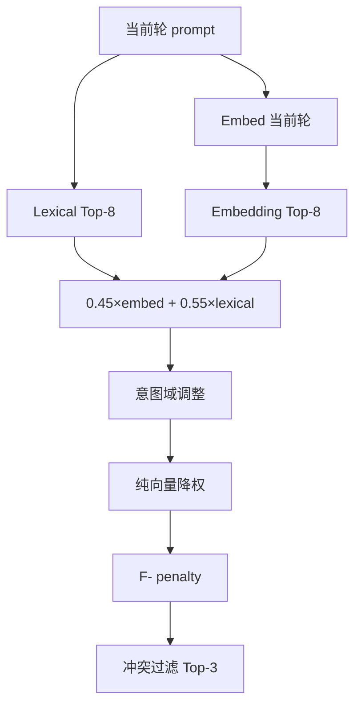

# Mobius Agent Skill 路由架构

Continue Agent 模式的 skill 智能路由分两阶段实现，借鉴 X For You 的多阶段漏斗思想（召回 → 排序 → 过滤），适配本地 IDE 规模。

**可视化：** [index.html](./index.html)（`npm run web` 后打开 `/static/architect/index.html`）

---

## 文档索引

| 文档 | 内容 |
|------|------|
| [skill-routing-phase1.md](./skill-routing-phase1.md) | 混合召回、意图域过滤、误匹配修复 |
| [skill-routing-phase2.md](./skill-routing-phase2.md) | Penalty-only 行为反馈（无 F+） |
| [hermes-wps-skill-routing-test-cases.md](./hermes-wps-skill-routing-test-cases.md) | Hermes + WPS 路由测试用例 |
| [hermes-wps-project-prompts.md](./hermes-wps-project-prompts.md) | 新建项目 Prompt + 路由验证 |

---

## Phase 1 — 混合召回 + 意图域过滤

**代码：** `continueSkillEmbeddings.ts`、`continueSkillsContext.ts`



| 要点 | 说明 |
|------|------|
| Query 来源 | **仅当前轮** `request.message`，chat history 不参与路由/embedding |
| Lexical | 中英文意图正则、`hasDesignUiIntent` 等域检测、精确 hint 段匹配 |
| Embedding | Skill 向量索引（SKILL.md），与历史消息无关 |
| 意图域 | `design-ui` / `document-ppt` / `document-word` / `git-pr` / `mcp` 等，离域 skill 减分或过滤 |
| 冲突规则 | interview ↔ execution；UI 设计 ↔ 文档/git；单文档类型 PPT ↔ Word 互斥 |
| 输出 | 最多 3 个兼容 skill → `<skill-context>` |

---

## Phase 2 — Penalty-only 行为反馈

**代码：** `continueSkillFeedback.ts`、`continueChatAgent.ts`

| Outcome | 记录 | 路由影响 |
|---------|------|----------|
| `write_success` | **跳过** | 无 |
| `write_failed` / `explore_only` / `no_execution` | failures +1 | F-（0 ~ -3） |

> `write_success` 不做 F+：写文件成功 ≠ skill 与 prompt 意图匹配。

---

## 日志与调试

```
[Continue] Skills auto-route [hybrid/feedback-on]: query="帮我设计个新页面吧" loaded=[frontend-design, canvas-design] top=frontend-design:f28.0(L22+E8.1+F0), ...
```

| 字段 | 含义 |
|------|------|
| `query=` | 当前轮路由 query（可审计） |
| `L` | Lexical 分 |
| `E` | Embedding 分 |
| `F` | Feedback 分（**≤ 0**，仅惩罚） |

本地无 embedding 诊断：`simulateLexicalSkillRouting(message, skills)`（`continueSkillsContext.ts` 导出）。

清除历史反馈：删除 Storage `continue.skillRoutingFeedback.v1`。

---

## 源码目录

```
vscode/src/vs/workbench/contrib/continue/browser/
  continueSkillsContext.ts      # 路由主逻辑
  continueSkillEmbeddings.ts    # 向量召回
  continueSkillFeedback.ts      # Phase 2 penalty
  continueChatAgent.ts          # Agent 工具 + 反馈采集
```
