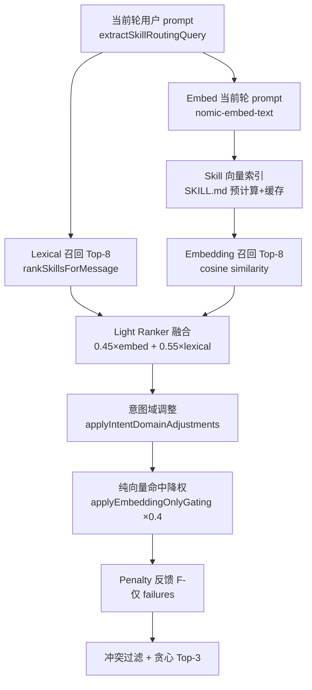

# Phase 1 — 混合召回 + 意图域过滤

| 阶段 | 说明 |
|------|------|
| **Query** | 只用 `request.message`（当前轮 prompt），**不含** chat history |
| Lexical 召回 | 关键词 / 中英文意图正则 / token 重叠 / `skillMatchesIntentHint` 精确段匹配 |
| Embedding 召回 | `nomic-embed-text` cosine Top-8；skill 向量来自 SKILL.md，非历史消息 |
| Light Ranker | `fused = 0.45×embed + 0.55×lexical` |
| 意图域调整 | 检测 `design-ui` / `document-ppt` / `document-word` / `git-pr` / `mcp` 等，加分本域、减分/过滤离域 |
| 纯向量降权 | 无 lexical 支持且与当前意图域不匹配的命中 ×0.4 |
| 冲突过滤 | interview ↔ execution；design-ui ↔ document/git；单文档类型时 PPT ↔ Word 互斥 |
| 输出 | 最多 3 个兼容 skill 注入 `<skill-context>` |

Ollama embed 不可用时自动降级为纯 lexical，不阻塞 Agent。

## 意图域示例

| 用户输入 | 预期主域 | 不应误载 |
|----------|----------|----------|
| 帮我设计个新页面吧 | `design-ui` → frontend-design | wps-ppt, update-pr |
| templates/quarterly-review.pptx 生成 PPT | `document-ppt` → wps-ppt | code-review（review 子串已修） |
| 生成 Word 方案文档 | `document-word` → wps-word | wps-ppt |
| vscode 如何装 MCP | `mcp` → mcp-builder | wps-* |

## 代码位置

- `vscode/src/vs/workbench/contrib/continue/browser/continueSkillEmbeddings.ts`
- `vscode/src/vs/workbench/contrib/continue/browser/continueSkillsContext.ts`
