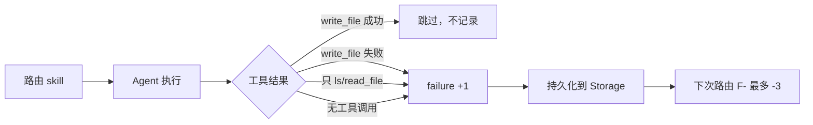

# Phase 2 — 行为反馈（Penalty-only）

> **设计修正：** `write_success` **不再**产生 F+。写文件成功只代表 Agent 执行力，不能证明 skill 与当前 prompt 意图匹配。



| Outcome | 条件 | 是否记录 |
|---------|------|----------|
| `write_success` | 至少 1 次 `write_file` 成功 | **否**（与路由质量无关） |
| `write_failed` | 调用了 `write_file` 但全部失败 | failures +1 → F- |
| `explore_only` | 只有 `ls` / `read_file` | failures +1 → F- |
| `no_execution` | 未调用任何工具 | failures +1 → F- |

- 同一轮路由的所有 skill **共享**该 session 的 outcome
- **仅惩罚、不奖励**：`getScoreBoost()` 范围 **0 ~ -3**，永不为正
- 至少 **2 次 failure** 样本后 F- 才生效
- 存储 key：`continue.skillRoutingFeedback.v1`（历史 `successes` 计数已被忽略）

最终分数：

```
fusedScore = 0.45×embed + 0.55×lexical + feedbackBoost   // feedbackBoost ≤ 0
```

## 为何不用 write_success 做 F+？

误路由场景：

```
用户: 帮我设计个新页面
误载: wps-ppt, wps-word
Agent: 仍然 write_file 成功
旧逻辑: wps-ppt F+ → 污染后续无关 prompt
```

`write_success` 与「skill 是否匹配意图」是正交的，只保留 explore / 失败类负向信号（如 `brainstorming` 导致只探索不写文件 → F-）。

## 代码位置

- `vscode/src/vs/workbench/contrib/continue/browser/continueSkillFeedback.ts`
- `vscode/src/vs/workbench/contrib/continue/browser/continueChatAgent.ts`（`classifySkillRoutingOutcome` + `recordOutcome`）
